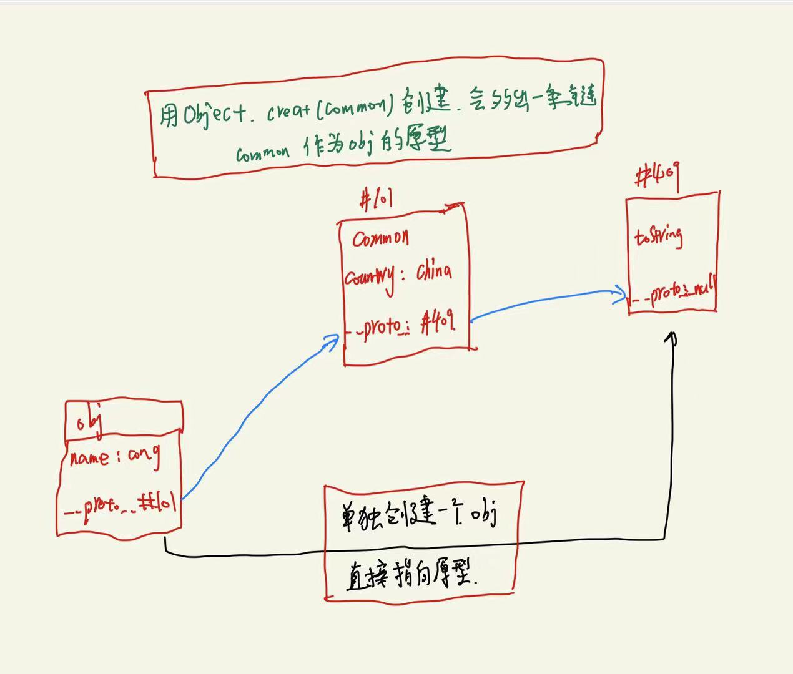

今天简单学习了js对象，学到了很重要的东西，这里简单记录一下学习笔记。

## 一，声明对象
定义：键值对的集合。**对象的属性名为字符串，不带引号设置也为字符串。**
let obj = {键：值}
```
let obj = {name:'cong', age:18}

let obj2 = new Object({name:'cong',age:18})

```
上述代码是两种声明方式，可以直接声明变量赋值，也可以使用标准写法声明。

## 二，删除属性

```
let obj = {name:'cong', age:18}
delete obj.name 
delete obj['name']

```
一般采用上述两种方式删除对象属性,需要注意的是，如果将属性值设置为undefined，属性名依然存在，只是值为undefined
判断属性名是否存在的方法-----> name in obj 

## 三，查（读）属性

```
let obj = {name:'cong', age:18}
Object.keys(obj)              //查看所有属性名（不包括隐藏属性）
Object.values(obj)            //查看所有属性值
Object.entries(obj)           //查看属性名和属性值
console.dir(obj)                //查看属性+隐藏属性
obj.key('name')               //查看单个属性的属性值
```
**需要注意的是obj[name],obj['name'],obj.name的区别。其中obj.name = obj['name']，obj[name]表示查看name变量对应的值，先变成字符串，再作为属性名，在obj中的属性值。**

## 四，增，改属性

```
let obj = {}
obj['name'] = 'cong'                   //如果存在就修改，不存在就增加
obj['age'] = 18
Object.assign(obj,{name:'cong',age:18})  // 同时增加或修改多个属性
```
以上两种为单个赋值和批量赋值。

## 五，原型链

每个对象都有原型，如果要自己创建一个对象的原型，可以这样创建。

```
let common = {country:'china',skinColor:'yellow'}      
let obj = Object.create(common)
Object.assign(obj,{name:'cong',age:18})
```
上述代码简单描述了先创建一个对象common，然后以这个对象为原型，创建obj，然后声明obj的多个属性。这样obj和原型之间就多了一个原型，这样就叫做原型链。

内存图如图所示




