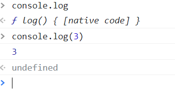

# 今天简单学习了一些js的基本语法

## 1，什么是表达式和语句
表达式一般都有值，语句可能有，也可能没有。比如
```
1+2                值为3
add(1,2)           值为函数的返回值 
console.log        值为函数本身
console.log(3)     值为函数的返回值--->undefined
```
上述都是表达式。
```
var a = 1
var b
```
这是一个语句，他可以有自己的值，也可以没有。
需要注意的是，值和返回值不同，只有函数有返回值。在js中大部分空格都没有实际意义，回车也是一样，在return后面不能加回车，如果加回车，他将返回undefined。

如果函数没有被调用，他的值就是他本身，如果函数被调用，他的值就是他的返回值。
如图所示



## 2，标识符的规则
第一个字符，可以是Unicode字母或￥或_或中文。
后面的字符，除了上述几种，还可以有数字。
变量名都是标识符
```
var _ = 1
var $ = 2
var ____ = 3
var 你好 = 'hi'
```

## 3，if else语句
if（表达式）{语句1}else{语句2}，用来做简单判断，如果表达式内容为true，执行语句1，否则执行语句2。if else 语句是可以嵌套使用的，可以添加多个if条件。if语句如果只有一句，{}可以省略，不推荐这样做。
```
if(表达式) {
    语句
} else if(表达式) {
    语句
} else {
    语句
}
```
一般这样使用就可以。

* 问号冒号表达式
if else语句的一种缩写形式，比如
```
if(a>b){
    console.log(a)
} else {
    console.log(b)
}
```
上述代码可以这样简写
```
a>b ? console.log(a) : console.log(b)
```
和if else实现的效果相同，如果a>b成立就console.log(a),否则console.log(b)，问号冒号表达式通常用来简写括号中语句只有一行代码的情况。

* &&短路逻辑
&&的话也是一种简化if else的一种写法，直接上代码实例。
```
var a = b && c && d
```
上述代码的意义是取a的值为b,c,d中第一个假值或者d。就是说如果b，c的值全是true，取值为d，如果b，c中有false，就取b，c中为false的那个值，即取得第一个假值或者d。（取的值为b，c，d中的一个，并不是true/false）

* ||短路逻辑
||和&&同理，只是简单逻辑不同。

```
var a = b||c||d
```
取值为第一个真值或者d。（不会取true或false）

* switch语句
可以理解为if else的升级版。
```
switch(fruit) {
    case 'banana':语句
    break
    case 'apple':语句
    break
    default '‘:语句
    break
}
```
一般不太常用，这里做简单了解。

## 4，while for语句
while语句的语法：

1，while(表达式){语句}

2，判断表达式的真假。

3，如果为真，执行语句，执行完再次判断真假。

4，如果为假，执行后面的语句。

for循环
可以理解为while语句的语法糖，就是while的方便写法。

语法：

1，for（语句1;表达式2;语句3;) {
    循环体
}

2,先执行语句1

3，然后判断表达式2，

4，如果为真，执行循环体，**然后执行语句3**

5，如果为假，跳出循环，执行后面的语句。

```
for(var i = 0; i<5;i++) {
    console.log(i)
}
```
上述就是一个简单的for循环语句

## 5，break continue
break的意思是退出所有循环。

continue的意思是跳出当前这一次循环。

## 6，label
label基本用不到，

语法：

```
foo: {
    console.log(1)
    break foo
    console.log('本行不输出')
}
console.log(2)
```
可以理解为一个代码块，他的名字叫foo。